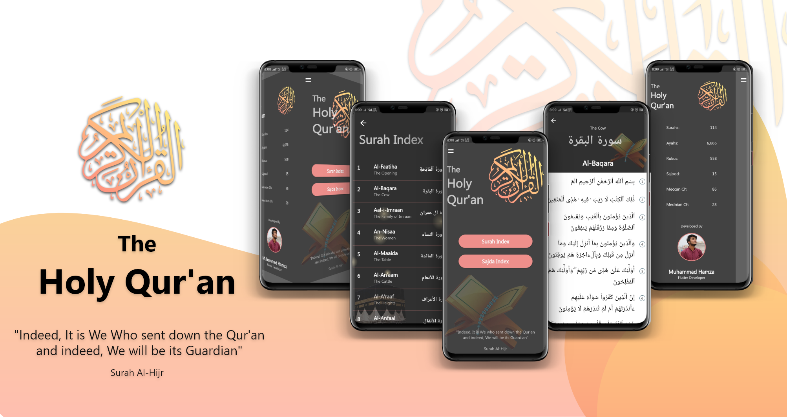
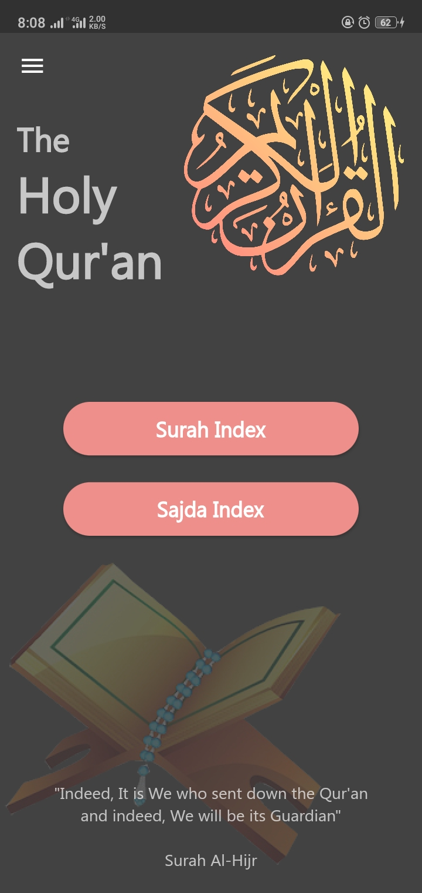
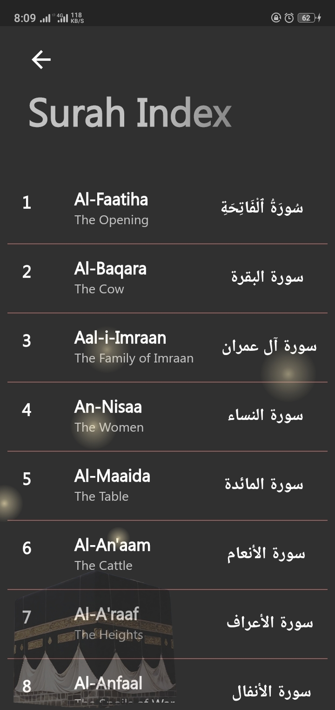
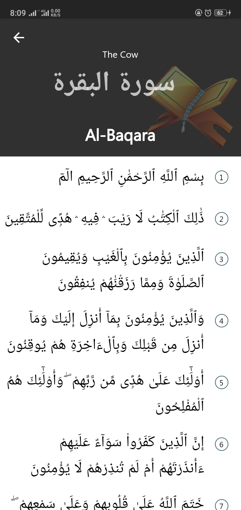
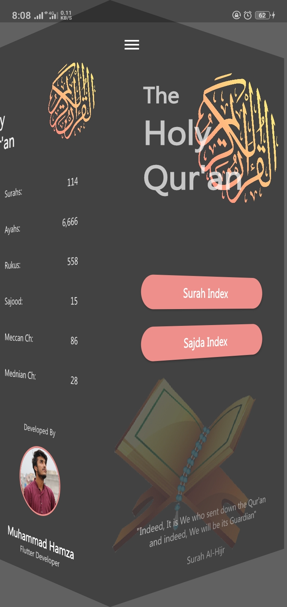
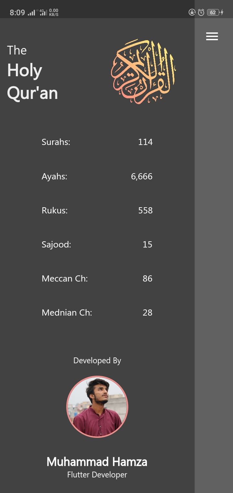

# The Holy Qur'an

Application of Holy book of Muslims, Al-Qur'an. Developed using Flutter
The data is fetched using API. So, it is not being stored locally. Information about API is given at the bottom of README.md

## Screen Shots

  
 

## API Information

API Used: https://alquran.cloud/api